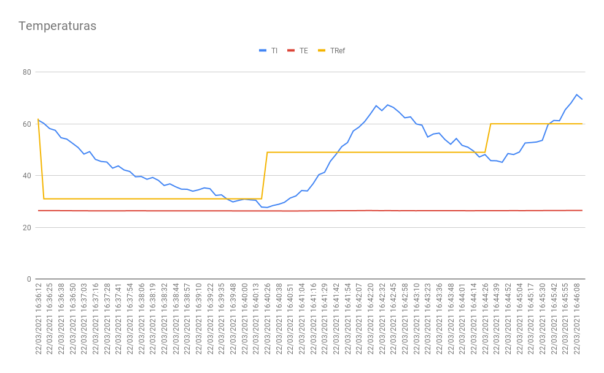
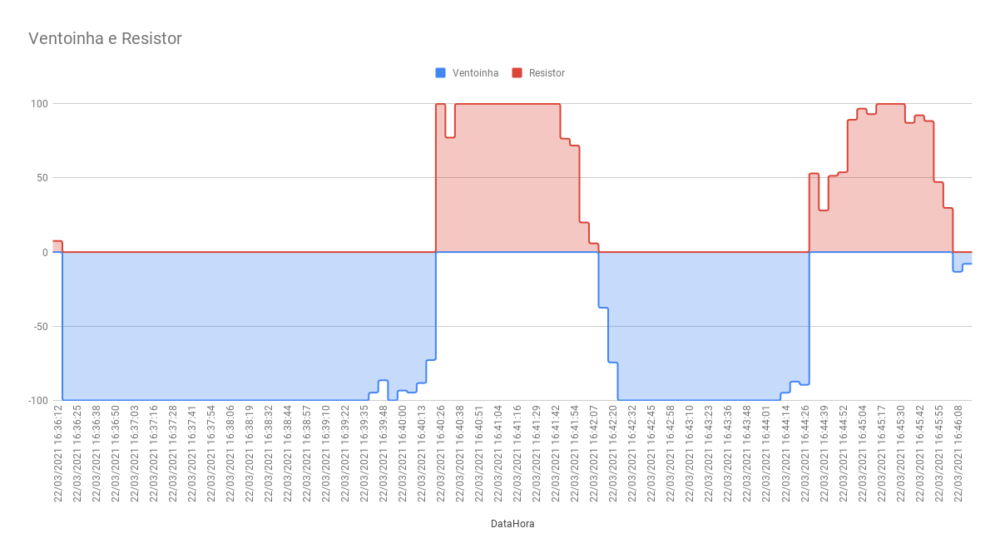

# Embedded Systems - Control temperature

Project 1 of the Fundamentals of Embedded Systems discipline, which consists of controlling the temperature of a system by means of a power resistor and a fan. Development and testing were done on a RaspberryPi. More details about the mechanism can be found [here](https://gitlab.com/fse_fga/projetos_2020_2/projeto-1-2020.2).

## Building

### External dependencies

There is a dependency that has not cloned with this repository:
* [Wiring Pi](http://wiringpi.com/download-and-install/)

### Compiling

```bash
# Clone the repository
$ git clone --recursive https://github.com/silvasara/embedded-systems-1.git

# Open the project
$ cd embedded-systems-1

# Make the build
$ make
```

### Running

```bash
# Execute
$ make run
```

## Experiment

The graphics below show the data during 10 minutes of project execution on Raspberry PI. The attributes are:
* TI - Internal Temperature
* TE - External Temperature
* TRef - Reference Temperature

### Graphic 1

Temperatures x Time


### Graphic 2

Resistor/Fan X Time

